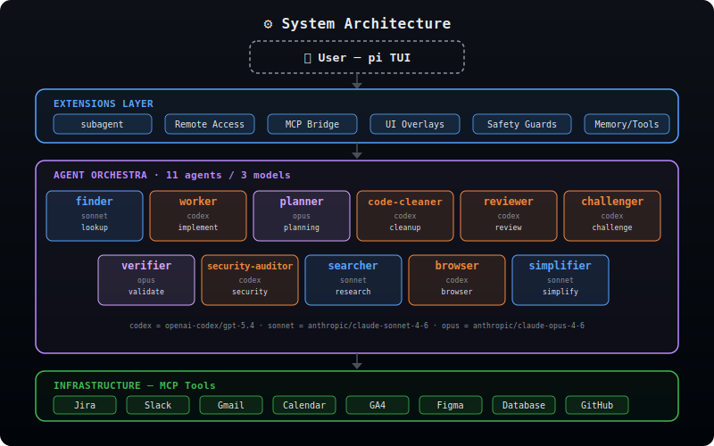
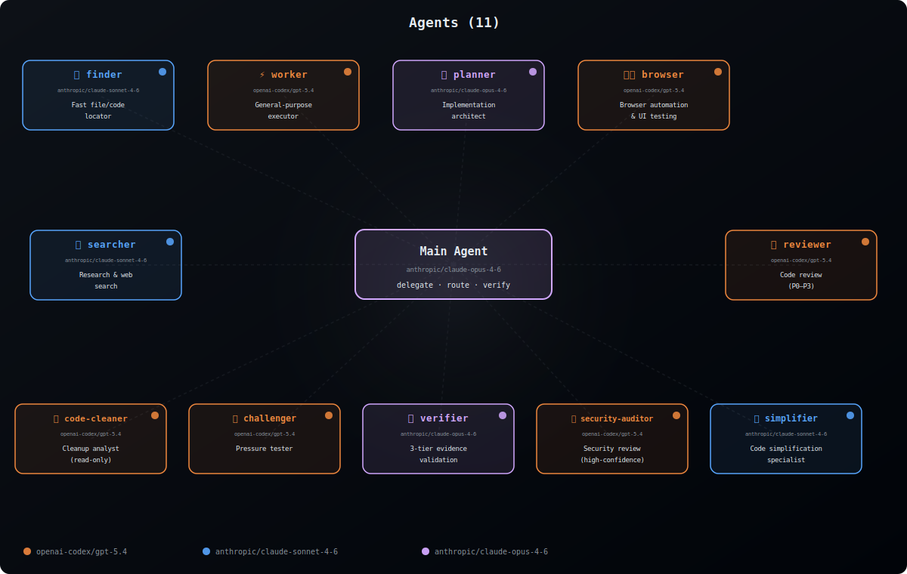

<div align="center">

**English** | [한국어](./README.md)

# 🧠 my-pi

**A personal AI operating system built on [pi](https://github.com/mariozechner/pi-coding-agent)**

*11 specialized agents · 25+ extensions · one developer's opinionated setup*

<br/>

`🤖 11 Agents` &nbsp; `🧩 25+ Extensions` &nbsp; `🎨 7 Themes`

<br/>

> What if you treated your AI coding agent configuration as a **first-class engineering project**?
>
> This repo is the answer — a living, daily-driven configuration that transforms pi from a CLI tool into a multi-agent orchestration platform with specialized roles, safety guards, and deep customization.

</div>

---

> [!WARNING]
> This repo is a fast-moving personal setup, so the documentation and actual behavior can drift at any time.
> Some features or configurations may be temporarily unstable or broken.


## 🏗️ Architecture

<p align="center">
  
</p>

The system is organized in **four layers**:

| Layer | Purpose |
|---|---|
| **User / pi TUI** | Interactive terminal interface |
| **Extensions** | 25+ TypeScript plugins — subagent management, voice I/O, MCP bridge, UI overlays, safety guards |
| **Agent Orchestra** | 11 specialized agent definitions with distinct roles and models |
| **Infrastructure** | MCP tool integrations via [claude-mcp-bridge](./extensions/claude-mcp-bridge/) — reuses your existing Claude Code MCP setup (Jira, Slack, Gmail, Calendar, GA4, Figma, DB, etc.) |

---

## 🤖 Agent Orchestra

<p align="center">
  
</p>

The current setup has 11 agent definitions, three models, and one orchestrator:

| Agent | Model | Role | When to Use |
|---|---|---|---|
| 🔍 **finder** | `anthropic/claude-sonnet-4-6` | Fast file & code locator | Quick lookups, grep-like tasks |
| ⚡ **worker** | `openai-codex/gpt-5.4` | General-purpose executor | Implementation, writing, fixes (complex multi-file) |
| 📐 **planner** | `anthropic/claude-opus-4-6` | Implementation architect | Breaking down complex tasks |
| ✨ **simplifier** | `anthropic/claude-sonnet-4-6` | Code simplification specialist | Clean up recently modified code, improve readability, preserve behavior |
| 🧹 **code-cleaner** | `openai-codex/gpt-5.4` | Code cleanup analyst | Find cleanup opportunities and quality issues |
| 🔎 **reviewer** | `openai-codex/gpt-5.4` | Code review (P0–P3 severity) | PR reviews, quality checks |
| 🥊 **challenger** | `openai-codex/gpt-5.4` | Pressure tester | Stress-test plans before execution |
| ✅ **verifier** | `anthropic/claude-opus-4-6` | 3-tier evidence validation | Verify claims, check correctness |
| 🔐 **security-auditor** | `openai-codex/gpt-5.4` | Security reviewer | Focused vulnerability reviews |
| 🌐 **searcher** | `anthropic/claude-sonnet-4-6` | Research & web search | Documentation lookup, exploration |
| 🖥️ **browser** | `openai-codex/gpt-5.4` | Browser automation & UI testing | E2E testing, visual verification |

<details>
<summary><strong>Model Selection Philosophy</strong></summary>

- **openai-codex/gpt-5.4** — General-purpose execution & review (implementation, testing, reviewing, security review, browser automation)
- **anthropic/claude-sonnet-4-6** — Fast exploration & research (file search, web research, code simplification)
- **anthropic/claude-opus-4-6** — Deep reasoning tasks (strategic planning, verification)

The orchestrator (main agent) runs on `anthropic/claude-opus-4-6`, ensuring strong reasoning depth for delegation decisions.

</details>

---

## 🧩 Extensions

Here are representative items from the 25+ custom TypeScript extensions, grouped by domain:

### Core System

| Extension | Description |
|---|---|
| **subagent/** | Multi-agent delegation engine — spawns sub-`pi` processes, manages runs with a below-editor status widget, and handles follow-up/cleanup |
| **system-mode/** | Toggle "Master mode" (delegation-only orchestrator) vs normal hands-on mode |
| **claude-mcp-bridge/** | Reuses Claude Code's MCP server configurations — zero-duplication setup |
| **cross-agent.ts** | Load agent definitions from `.claude/`, `.gemini/`, `.codex/` directories |
| **dynamic-agents-md.ts** | Dynamically loads AGENTS.md at runtime to enforce edit/write scope restrictions |
| **escalate-tool.ts** | Escalation tool for subagents to signal the master when judgment is needed |
| **claude-hooks-bridge.ts** | Bridge connecting Claude Code hook events to Pi sessions |
| **memory-layer/** | Persistent memory system across sessions |

### UI / UX

| Extension | Description |
|---|---|
| **footer.ts** | Custom footer showing model, git branch, context usage |
| **working-text.ts** | Humorous spinner text with elapsed time during processing |
| **idle-screensaver.ts** | Terminal screensaver when idle |
| **theme-cycler.ts** | `Ctrl+X` to cycle through all themes on-the-fly |
| **diff-overlay.ts** | `/diff` — split-pane git diff viewer overlay |
| **github-overlay.ts** | GitHub PR view directly in the terminal |
| **files.ts** | `/files` — git tree file browser with open/edit/diff quick actions |
| **fork-panel.ts** | `/fork-panel` — fork the current session into a new Ghostty split panel |
| **generative-ui/** | `visualize_read_me`, `show_widget` — native visual widgets and renderers |
| **override-builtin-tools.ts** | Collapse/expand verbose tool output for cleaner sessions |

### Developer Tools

| Extension | Description |
|---|---|
| **todo-write.ts** | Task management — `todo_write` tool, persistent storage, TUI rendering |
| **session-replay.ts** | `/replay` — browse and replay past sessions |
| **auto-name.ts** | Auto-detect session name from first user message |
| **upload-image-url.ts** | Upload images to GitHub CDN for embedding |
| **clipboard.ts** | Copy text to clipboard via OSC52 escape sequences |
| **ask-user-question.ts** | Interactive question tool with predefined options |
| **delayed-action.ts** | Schedule deferred actions |
| **until.ts** | `/until`, `until_report` — repeat work until a condition is met |
| **usage-analytics.ts** | `/analytics` — subagent and skill usage analytics overlay |
| **archive-to-html.ts** | Auto-archive HTML files generated by the to-html skill to `~/Documents` |

### Safety

| Extension | Description |
|---|---|
| **damage-control-rmrf.ts** | 🛡️ Blocks destructive `rm -rf` commands before they execute |
| **command-typo-assist.ts** | Detects command typos and offers auto-correction |

---

## 📋 Prompt Templates

Reusable workflow templates invoked with `/template-name`:

### `/one-shot` — Full Research & Solve Pipeline

A heavyweight problem-solving template that enforces:

1. **Research first** — understand context before acting
2. **Explore alternatives** — consider trade-offs broadly
3. **Unlimited subagent use** — delegate freely across agents
4. **Mandatory challenger gates** — pressure-test before and after execution
5. **3-tier validation** — automated tests → browser verification → source analysis
6. **HTML deliverables** — final report, alternatives explored, retrospective

```
/one-shot Fix the race condition in the payment processing pipeline
```

### `/qa-chain` — QA Pipeline

Chains multiple agents for end-to-end quality assurance:

```
worker → browser → verifier → reviewer
```

```pseudo
scenarios = worker("analyze changes, derive test scenarios")
results   = browser(scenarios, "test each in real browser")
fixes     = worker(failures, "fix issues")  →  verifier(fixes)
retest    = browser("verify fixes with screenshots")
final     = reviewer("review all changes")
```

---

## 🏷️ Session Name

`/name` is a built-in command, not a prompt template.

```
/name <session name>   # set name
/name                  # show current name
```

---

## 🎨 Themes

The setup currently ships with 7 themes, hot-swappable with `Ctrl+X`:

| Theme | Style |
|---|---|
| **nord** *(default)* | Arctic, clean blues and frost tones |
| **catppuccin-mocha** | Warm pastels on dark chocolate |
| **darcula** | Deep JetBrains-style dark tones |
| **dracula** | Higher-contrast purple-toned dark theme |
| **gruvbox** | Retro warm tones, easy on the eyes |
| **midnight-ocean** | Deep sea blues and teals |
| **rose-pine** | Muted, elegant rose tones |

---

## ⌨️ Keybindings

| Key | Action |
|---|---|
| `Ctrl+T` | Toggle thinking visibility |
| `Ctrl+X` | Cycle themes |
| `Ctrl+Q` | Cycle themes backward |
| `Ctrl+Shift+O` | Open file browser |
| `Ctrl+Shift+F` | Reveal the latest file reference in Finder |
| `Ctrl+Shift+R` | Quick Look the latest file reference |
| `Ctrl+O` | Toggle tool output collapse/expand |


## 🌐 Web Research Extension

This setup uses **pi-web-access** for `web_search`, `fetch_content`, and `get_search_content` tools.

- Repository: https://github.com/nicobailon/pi-web-access

```bash
pi install npm:pi-web-access
```
---

## 💡 Philosophy

This project is built on a few core beliefs:

**1. Agent configuration is engineering, not just config files.**
Every agent prompt is crafted like a job description. Every extension solves a real friction point. Every automation earns its complexity.

**2. Specialization beats generalization.**
A reviewer that only reviews catches more bugs than a generalist asked to "also review." The challenger agent exists solely to poke holes — and it's one of the most valuable agents in the system.

**3. Safety is a feature, not a constraint.**
`damage-control-rmrf.ts` exists because one accidental `rm -rf /` is one too many. Typo detection, confirmation prompts, and thinking visibility are all first-class concerns.

**4. The terminal is the IDE.**
Voice input, git diffs, GitHub PRs, screensavers — all inside the terminal. No context-switching required.

---

## 📈 Stats

This is not a demo project. It's a **living configuration** used daily for production engineering work.

| Metric | Value |
|---|---|
| Active extensions | 25+ |
| Agent definitions | 11 |
| Themes | 7 |

---

<div align="center">

*Built and used daily by [@Jonghakseo](https://github.com/Jonghakseo)*

*Powered by [pi coding agent](https://github.com/mariozechner/pi-coding-agent)*

</div>
