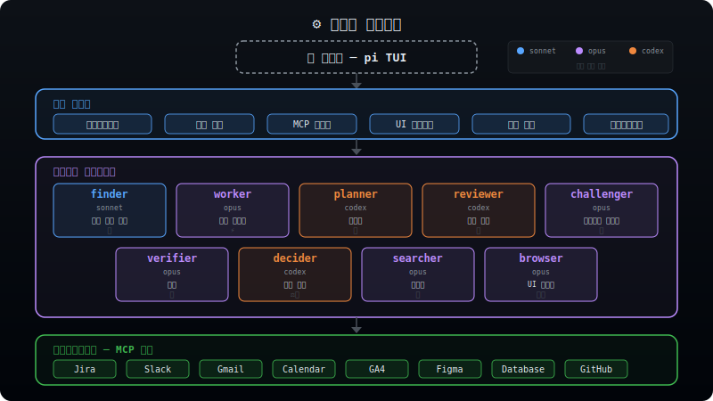
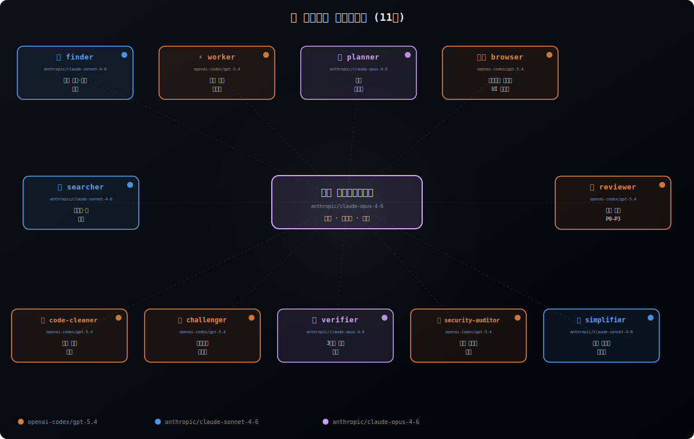

[English](./README.md) | **한국어**

# my-pi

일상 개발에 사용하는 [pi](https://github.com/mariozechner/pi-coding-agent) 설정이다.

이 저장소에는 하나의 작업 환경에서 함께 쓰는 에이전트 정의, 확장 기능, 스킬, 프롬프트, 테마가 들어 있다.

> [!NOTE]
> 개인 실사용 셋업이라 문서가 현재 상태보다 늦을 수 있고, 일부 내용은 예고 없이 바뀔 수 있다.

## 아키텍처

<p align="center">
  
</p>

시스템은 **네 개의 레이어**로 구성된다:

| 레이어 | 역할 |
|---|---|
| **사용자 / pi TUI** | 터미널 기반 인터랙티브 인터페이스 |
| **확장 기능** | 30개 이상의 TypeScript 플러그인 — 서브에이전트, MCP 브릿지, 원격 접속, UI 오버레이, 안전 장치 |
| **에이전트** | 역할과 모델이 다른 11개의 전문 에이전트 정의 |
| **인프라** | `@ryan_nookpi/pi-extension-claude-mcp-bridge`를 통한 MCP 도구 연동 — 기존 Claude Code MCP 설정을 그대로 재사용 (Jira, Slack, Gmail, Calendar, GA4, Figma, DB 등) |

---

## 에이전트

<p align="center">
  
</p>

현재 기준 11개의 에이전트 정의, 3개의 모델, 하나의 메인 에이전트로 구성된다:

| 에이전트 | 모델 | 역할 | 사용 시점 |
|---|---|---|---|
| **finder** | `anthropic/claude-sonnet-4-6` | 빠른 파일·코드 탐색 | 빠른 조회, grep 스타일 탐색 |
| **worker** | `openai-codex/gpt-5.4` | 범용 작업 실행기 | 구현, 작성, 수정 (복잡한 다중 파일) |
| **planner** | `anthropic/claude-opus-4-7` | 구현 설계자 | 복잡한 작업 분할 |
| **simplifier** | `anthropic/claude-sonnet-4-6` | 코드 단순화 전문가 | 최근 수정 코드 정리, 가독성 개선, 동작 보존 리팩터링 |
| **code-cleaner** | `anthropic/claude-opus-4-7` | 코드 정리 분석가 | 중복 제거 후보, 품질 문제 탐색 |
| **reviewer** | `openai-codex/gpt-5.4` | 코드 리뷰 (P0–P3 심각도) | PR 리뷰, 품질 점검 |
| **challenger** | `openai-codex/gpt-5.4` | 스트레스 테스터 | 실행 전 계획 검증 |
| **verifier** | `anthropic/claude-opus-4-7` | 3단계 근거 검증 | 주장 확인, 정확성 점검 |
| **security-auditor** | `openai-codex/gpt-5.4` | 보안 검토자 | 취약점 중심 리뷰 |
| **searcher** | `anthropic/claude-sonnet-4-6` | 리서치·웹 검색 | 문서 탐색, 조사 |
| **browser** | `openai-codex/gpt-5.4` | 브라우저 자동화·UI 테스트 | E2E 테스트, 시각 검증 |

<details>
<summary><strong>모델 선택 기준</strong></summary>

- **openai-codex/gpt-5.4** — 범용 실행·리뷰 (구현, 테스트, 리뷰, 보안 검토, 브라우저 자동화)
- **anthropic/claude-sonnet-4-6** — 빠른 탐색·리서치 (파일 검색, 웹 리서치, 코드 단순화)
- **anthropic/claude-opus-4-7** — 깊은 추론 작업 (전략 설계, 검증)

메인 에이전트는 `anthropic/claude-opus-4-7` 기반으로 동작하며 위임 결정을 수행한다.

</details>

---

## 확장 기능

주요 확장을 영역별로 정리했다:

### 코어 시스템

| 확장 | 설명 |
|---|---|
| **subagent/** | 멀티 에이전트 위임 엔진 — 서브 `pi` 프로세스 생성, below-editor 상태 위젯으로 실행 관리, 자동 follow-up/정리, 서브세션 전용 `ask_master` 에스컬레이션 포함 |
| **[@ryan_nookpi/pi-extension-claude-mcp-bridge](https://github.com/Jonghakseo/pi-extension/tree/main/packages/claude-mcp-bridge)** | Claude Code의 MCP 서버 설정을 그대로 재사용 — 중복 설정 제로 |
| **[@ryan_nookpi/pi-extension-cross-agent](https://github.com/Jonghakseo/pi-extension/tree/main/packages/cross-agent)** | `.claude/`, `.gemini/`, `.codex/` 디렉터리에서 에이전트 정의 로드 |
| **dynamic-agents-md.ts** | 런타임에 AGENTS.md를 동적 로드하여 편집·쓰기 범위 제한 강제 |
| **[@ryan_nookpi/pi-extension-claude-hooks-bridge](https://github.com/Jonghakseo/pi-extension/tree/main/packages/claude-hooks-bridge)** | Claude Code의 훅(hook) 이벤트를 Pi 세션에 연결하는 브릿지 |
| **[@ryan_nookpi/pi-extension-memory-layer](https://github.com/Jonghakseo/pi-extension/tree/main/packages/memory-layer)** | 세션 간 영속 메모리 시스템 |

### UI / UX

| 확장 | 설명 |
|---|---|
| **footer.ts** | 모델, git 브랜치, 컨텍스트 사용량을 보여주는 커스텀 푸터 |
| **working-text.ts** | 처리 중 경과 시간과 함께 팁 중심 스피너 텍스트 |
| **theme-cycler.ts** | `Ctrl+Shift+X`로 테마 실시간 순환 |
| **diff-overlay.ts** | `/diff` — 분할 화면 git diff 뷰어 오버레이 |
| **[@ryan_nookpi/pi-extension-open-pr](https://github.com/Jonghakseo/pi-extension/tree/main/packages/open-pr)** | 현재 브랜치 PR을 브라우저에서 바로 열기 |
| **files.ts** | `/files` — git 트리 파일 브라우저 + 열기/편집/diff 빠른 액션 |
| **fork-panel.ts** | `/fork-panel` — 현재 세션을 새 Ghostty split panel로 포크 |
| **[@ryan_nookpi/pi-extension-generative-ui](https://github.com/Jonghakseo/pi-extension/tree/main/packages/generative-ui)** | `visualize_read_me`, `show_widget` — 네이티브 시각화/위젯 렌더링 |
| **override-builtin-tools.ts** | 도구 출력 접기/펼치기로 세션 깔끔하게 유지 |

### 개발 도구

| 확장 | 설명 |
|---|---|
| **upload-image-url.ts** | GitHub CDN으로 이미지 업로드 후 임베딩 |
| **until.ts** | `/until`, `until_report` — 조건 충족까지 반복 실행 |
| **usage-analytics.ts** | `/analytics` — 서브에이전트·스킬 사용 통계 오버레이 |
| **archive-to-html.ts** | to-html 스킬로 생성된 HTML 파일을 `~/Documents`에 자동 아카이브 |

### 안전 장치

| 확장 | 설명 |
|---|---|
| **command-typo-assist.ts** | 명령어 오타를 감지하고 자동 수정 제안 |

### 설치형 npm 확장 패키지

현재 `settings.json`에 등록된 확장 패키지 목록은 다음과 같다.

| 패키지 | 역할 |
|---|---|
| [`@ryan_nookpi/pi-extension-codex-fast-mode`](https://github.com/Jonghakseo/pi-extension/tree/main/packages/codex-fast-mode) | Codex Fast Mode 토글 |
| [`@ryan_nookpi/pi-extension-clipboard`](https://github.com/Jonghakseo/pi-extension/tree/main/packages/clipboard) | 클립보드 복사 도구 |
| [`@ryan_nookpi/pi-extension-ask-user-question`](https://github.com/Jonghakseo/pi-extension/tree/main/packages/ask-user-question) | 인터랙티브 질문 도구 |
| [`@ryan_nookpi/pi-extension-auto-name`](https://github.com/Jonghakseo/pi-extension/tree/main/packages/auto-name) | 세션 이름 자동 지정 |
| [`@ryan_nookpi/pi-extension-delayed-action`](https://github.com/Jonghakseo/pi-extension/tree/main/packages/delayed-action) | 지연 실행 액션 |
| [`@ryan_nookpi/pi-extension-idle-screensaver`](https://github.com/Jonghakseo/pi-extension/tree/main/packages/idle-screensaver) | 유휴 스크린세이버 |
| [`@ryan_nookpi/pi-extension-todo-write`](https://github.com/Jonghakseo/pi-extension/tree/main/packages/todo-write) | `todo_write` 도구 |
| [`@ryan_nookpi/pi-extension-cc-system-prompt`](https://github.com/Jonghakseo/pi-extension/tree/main/packages/cc-system-prompt) | Claude Code 스타일 시스템 프롬프트 |
| [`@ryan_nookpi/pi-extension-open-pr`](https://github.com/Jonghakseo/pi-extension/tree/main/packages/open-pr) | 현재 브랜치 PR 열기 |
| [`@ryan_nookpi/pi-extension-generative-ui`](https://github.com/Jonghakseo/pi-extension/tree/main/packages/generative-ui) | `visualize_read_me`, `show_widget` |
| [`@ryan_nookpi/pi-extension-cross-agent`](https://github.com/Jonghakseo/pi-extension/tree/main/packages/cross-agent) | `.claude`, `.gemini`, `.codex` 명령 로드 |
| [`@ryan_nookpi/pi-extension-claude-hooks-bridge`](https://github.com/Jonghakseo/pi-extension/tree/main/packages/claude-hooks-bridge) | Claude Code hooks 브릿지 |
| [`@ryan_nookpi/pi-extension-claude-mcp-bridge`](https://github.com/Jonghakseo/pi-extension/tree/main/packages/claude-mcp-bridge) | Claude Code MCP 브릿지 |
| [`@ryan_nookpi/pi-extension-memory-layer`](https://github.com/Jonghakseo/pi-extension/tree/main/packages/memory-layer) | 영속 메모리 도구 |

---

## 세션 이름

`/name`은 프롬프트 템플릿이 아니라 **내장 명령**이다.

```
/name <세션 이름>   # 이름 설정
/name               # 현재 이름 확인
```

---

## 테마

현재 7개 테마를 제공하며, `Ctrl+Shift+X`로 실시간 전환할 수 있다:

| 테마 | 스타일 |
|---|---|
| **nord** *(기본)* | 북극풍, 깔끔한 블루와 서리 톤 |
| **catppuccin-mocha** | 다크 초콜릿 위의 따뜻한 파스텔 |
| **darcula** | JetBrains 스타일의 진한 다크 톤 |
| **dracula** | 대비가 선명한 퍼플 계열 다크 테마 |
| **gruvbox** | 레트로 따뜻한 톤, 눈이 편한 |
| **midnight-ocean** | 깊은 바다 블루와 틸 |
| **rose-pine** | 차분하고 우아한 로즈 톤 |

---

## 단축키

| 키 | 동작 |
|---|---|
| `Ctrl+T` | 사고(thinking) 표시 토글 |
| `Ctrl+Shift+X` | 테마 순환 |
| `Ctrl+Q` | 테마 역순 순환 |
| `Ctrl+Shift+O` | 파일 브라우저 열기 |
| `Ctrl+Shift+F` | 최근 파일 참조를 Finder에서 표시 |
| `Ctrl+Shift+R` | 최근 파일 참조 Quick Look |
| `Ctrl+O` | 도구 출력 접기/펼치기 (pi 기본, `override-builtin-tools.ts`로 커스터마이즈) |


## 웹 리서치 확장

이 셋업은 `web_search`, `fetch_content`, `get_search_content` 도구 사용을 위해 **pi-web-access** 소스를 로컬 `extensions/web-access/`에 벤더링해서 사용한다.

- 업스트림 레포지토리: https://github.com/nicobailon/pi-web-access
- 확장 로컬 경로: `extensions/web-access/`
- 포함된 `librarian` 스킬 로컬 경로: `skills/librarian/`

---

## 메모

이 셋업은 다음 기준으로 정리되어 있다:

**1. 역할을 분리한다.**
에이전트마다 책임을 좁게 나눠서 위임 흐름을 단순하게 유지한다.

**2. 반복되는 불편에만 확장을 추가한다.**
커스텀 도구는 주로 반복 작업을 줄이기 위해 만든다.

**3. 안전 장치를 기본값으로 둔다.**
오타 감지, 확인 단계, 표시 제어를 기본 흐름에 포함한다.

**4. 가능한 한 터미널 안에서 처리한다.**
파일 탐색, diff, PR 작업, 자동화를 같은 환경에서 처리한다.


