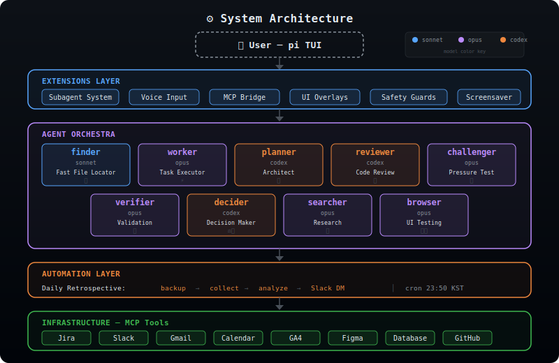
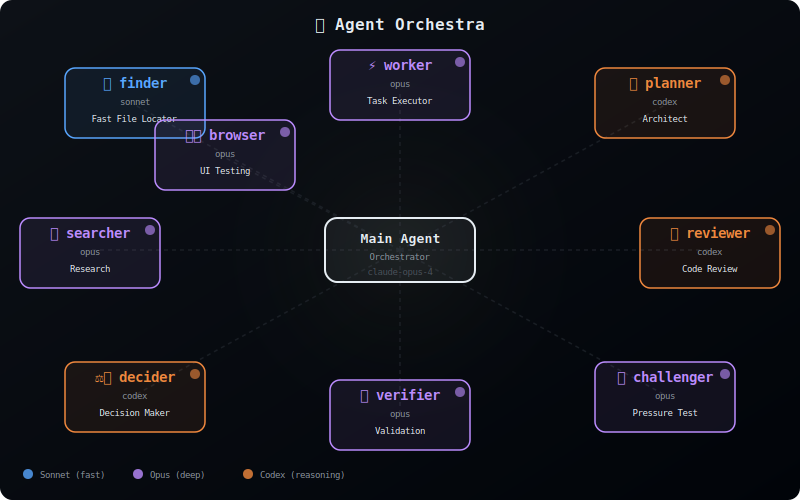

<div align="center">

# 🧠 my-pi

**A personal AI operating system built on [pi](https://github.com/mariozechner/pi-coding-agent)**

*9 specialized agents · 20+ extensions · one developer's opinionated setup*

<br/>

`🤖 9 Agents` &nbsp; `🧩 20+ Extensions` &nbsp; `🎨 5 Themes` &nbsp; `🔧 8 MCP Integrations`

<br/>

> What if you treated your AI coding agent configuration as a **first-class engineering project**?
>
> This repo is the answer — a living, daily-driven configuration that transforms pi from a CLI tool into a multi-agent orchestration platform with specialized roles, safety guards, and deep customization.

</div>

---

## 🏗️ Architecture

<p align="center">
  
</p>

The system is organized in **four layers**:

| Layer | Purpose |
|---|---|
| **User / pi TUI** | Interactive terminal interface |
| **Extensions** | 20+ TypeScript plugins — subagent management, voice I/O, MCP bridge, UI overlays, safety guards |
| **Agent Orchestra** | 9 purpose-built agents with distinct models and roles |
| **Infrastructure** | MCP tool integrations — Jira, Slack, Gmail, Calendar, GA4, Figma, Database, GitHub |

---

## 🤖 Agent Orchestra

<p align="center">
  
</p>

Nine agents, three models, one orchestrator. Each agent has a specific mandate, its own system prompt, and a model chosen for its strengths:

| Agent | Model | Role | When to Use |
|---|---|---|---|
| 🔍 **finder** | `sonnet` | Fast file & code locator | Quick lookups, grep-like tasks |
| ⚡ **worker** | `opus` | General-purpose executor | Implementation, writing, fixes |
| 📐 **planner** | `codex` | Implementation architect | Breaking down complex tasks |
| 🔎 **reviewer** | `codex` | Code review (P0–P3 severity) | PR reviews, quality checks |
| 🥊 **challenger** | `opus` | Pressure tester | Stress-test plans before execution |
| ✅ **verifier** | `opus` | 3-tier evidence validation | Verify claims, check correctness |
| ⚖️ **decider** | `codex` | Technical decision maker | Architecture choices, trade-offs |
| 🌐 **searcher** | `opus` | Research & web search | Documentation lookup, exploration |
| 🖥️ **browser** | `opus` | Browser automation & UI testing | E2E testing, visual verification |

<details>
<summary><strong>Model Selection Philosophy</strong></summary>

- **Sonnet** — Speed-optimized tasks (file search, quick lookups)
- **Opus** — Deep reasoning tasks (code execution, analysis, creative work)
- **Codex** — Structured reasoning tasks (planning, reviewing, decision-making)

The orchestrator (main agent) runs on `claude-opus-4` with `xhigh` thinking, ensuring maximum reasoning depth for delegation decisions.

</details>

---

## 🧩 Extensions

Over 20 custom TypeScript extensions organized by domain:

### Core System

| Extension | Description |
|---|---|
| **subagent/** | Multi-agent delegation engine — spawns sub-pi processes, manages concurrent runs with pixel-art status widget, hang detection, and automatic cleanup |
| **system-mode/** | Toggle "Master mode" (delegation-only orchestrator) vs normal hands-on mode |
| **claude-mcp-bridge/** | Reuses Claude Code's MCP server configurations — zero-duplication setup |
| **cross-agent.ts** | Load agent definitions from `.claude/`, `.gemini/`, `.codex/` directories |
| **memory-layer/** | Persistent memory system across sessions |

### UI / UX

| Extension | Description |
|---|---|
| **voice-input.ts** | `Option+V` voice dictation with TTS response — talk to your agent |
| **pipi-footer.ts** | Custom footer showing model, git branch, context usage |
| **working-text.ts** | Humorous spinner text with elapsed time during processing |
| **idle-screensaver.ts** | Terminal screensaver when idle |
| **theme-cycler.ts** | `Ctrl+X` to cycle through all themes on-the-fly |
| **diff-overlay.ts** | `/diff` — split-pane git diff viewer overlay |
| **github-overlay.ts** | GitHub PR view directly in the terminal |
| **status-overlay.ts** | `/status` — extension and skill status dashboard |
| **minimal-mode.ts** | Collapse/expand verbose tool output for cleaner sessions |

### Developer Tools

| Extension | Description |
|---|---|
| **todos.ts** | Task management with persistent storage and TUI |
| **session-replay.ts** | `/replay` — browse and replay past sessions |
| **context.ts** | `/context` — context window usage statistics |
| **purpose.ts** | Pin a session purpose that persists across compactions |
| **upload-image-url.ts** | Upload images to GitHub CDN for embedding |
| **ask-user-question.ts** | Interactive question tool with predefined options |
| **delayed-action.ts** | Schedule deferred actions |
| **archive-to-html.ts** | Export sessions to styled HTML documents |

### Safety

| Extension | Description |
|---|---|
| **damage-control-rmrf.ts** | 🛡️ Blocks destructive `rm -rf` commands before they execute |
| **command-typo-assist.ts** | Detects command typos and offers auto-correction |

---

## 📋 Prompt Templates

Reusable workflow templates invoked with `/template-name`:

### `/one-shot` — Full Research & Solve Pipeline

A heavyweight problem-solving template that enforces:

1. **Research first** — understand context before acting
2. **Explore alternatives** — consider trade-offs broadly
3. **Unlimited subagent use** — delegate freely across agents
4. **Mandatory challenger gates** — pressure-test before and after execution
5. **3-tier validation** — automated tests → browser verification → source analysis
6. **HTML deliverables** — final report, alternatives explored, retrospective

```
/one-shot Fix the race condition in the payment processing pipeline
```

### `/qa-chain` — QA Pipeline

Chains multiple agents for end-to-end quality assurance:

```
worker → browser → verifier → reviewer
```

```pseudo
scenarios = worker("analyze changes, derive test scenarios")
results   = browser(scenarios, "test each in real browser")
fixes     = worker(failures, "fix issues")  →  verifier(fixes)
retest    = browser("verify fixes with screenshots")
final     = reviewer("review all changes")
```

### `/set-purpose` — Auto Session Purpose

Automatically sets the session purpose from the current context.

---

## 🎨 Themes

Five hand-picked themes, hot-swappable with `Ctrl+X`:

| Theme | Style |
|---|---|
| **nord** *(active)* | Arctic, clean blues and frost tones |
| **catppuccin-mocha** | Warm pastels on dark chocolate |
| **gruvbox** | Retro warm tones, easy on the eyes |
| **midnight-ocean** | Deep sea blues and teals |
| **rose-pine** | Muted, elegant rose tones |

---

## ⌨️ Keybindings

| Key | Action |
|---|---|
| `Ctrl+T` | Toggle thinking visibility |
| `Ctrl+X` | Cycle themes |
| `Option+V` | Voice input (dictation + TTS) |

---

## 📦 Install as pi Package

> **Prerequisite:** [pi coding agent](https://github.com/mariozechner/pi-coding-agent) installed globally.

### Option A: pi package (recommended)

```bash
# Global install
pi install git:https://github.com/Jonghakseo/my-pi.git

# Project-local install
pi install -l git:https://github.com/Jonghakseo/my-pi.git
```

### Option B: Clone manually

```bash
git clone https://github.com/Jonghakseo/my-pi.git ~/.pi/agent
cd ~/.pi/agent/extensions && pnpm install
```

### Post-install

```bash
cp auth.json.example auth.json  # Add your API keys
pi                               # Launch — extensions load automatically
```

### Agent Definitions

> **Note:** Agent `.md` files in `agents/` are **not** a pi standard package resource — `pi install` does not auto-register them.

This package includes a `postinstall` script that copies missing agent definitions from the repo's `agents/` directory into `~/.pi/agent/agents/`. It will **never overwrite** existing files, so your local customizations are always safe.

To manually re-sync agents at any time:

```bash
npm run sync-agents           # copy only missing agents
node scripts/sync-agents.mjs --force   # overwrite all (use with caution)
```

---

## 💡 Philosophy

This project is built on a few core beliefs:

**1. Agent configuration is engineering, not just config files.**
Every agent prompt is crafted like a job description. Every extension solves a real friction point. Every automation earns its complexity.

**2. Specialization beats generalization.**
A reviewer that only reviews catches more bugs than a generalist asked to "also review." The challenger agent exists solely to poke holes — and it's one of the most valuable agents in the system.

**3. Safety is a feature, not a constraint.**
`damage-control-rmrf.ts` exists because one accidental `rm -rf /` is one too many. Typo detection, confirmation prompts, and thinking visibility are all first-class concerns.

**4. The terminal is the IDE.**
Voice input, git diffs, GitHub PRs, screensavers — all inside the terminal. No context-switching required.

---

## 📈 Stats

This is not a demo project. It's a **living configuration** used daily for production engineering work.

| Metric | Value |
|---|---|
| Active extensions | 20+ |
| Agent definitions | 9 |
| Themes | 5 |
| MCP integrations | 8 |

---

<div align="center">

*Built and used daily by [@Jonghakseo](https://github.com/Jonghakseo)*

*Powered by [pi coding agent](https://github.com/mariozechner/pi-coding-agent)*

</div>
