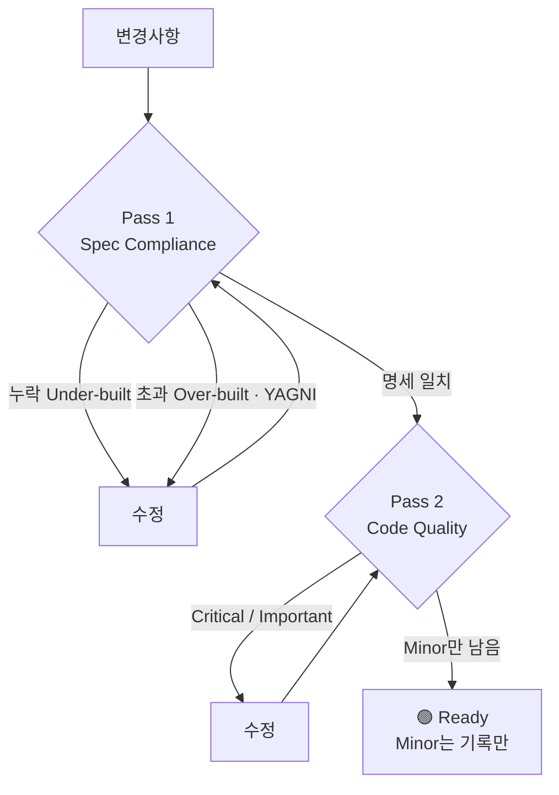

# stress-interview

`$ARGUMENTS`에 대해 **`verifier` + `reviewer` + `challenger`를 병렬 호출**해 교차 검토한다.

## 목적
- 구현/수정 사항을 배포 전 관점에서 압박 검토한다.
- 실행 증거, 코드 리뷰, 반론/리스크를 동시에 수집한다.
- 한 에이전트의 편향을 줄이고, 겹치는 지적과 상충 지적을 비교한다.

## 실행 규칙
1. 먼저 검토 대상을 1~2문장으로 재정의한다.
2. `subagent`는 셸 바이너리가 아니라 **Pi 도구**다. `bash`에서 `subagent ...`를 실행하지 말고, 반드시 `functions.subagent` 도구를 `{ "command": "subagent ..." }` 형태로 호출한다.
3. `subagent help`가 아직 확인되지 않았거나 현재 세션에서 인터페이스가 불명확하면 먼저 Pi 도구로 확인한다.
   - 예: `subagent({ command: "subagent help" })`
4. 아래 3개를 **병렬**로 실행한다.
   - 모든 에이전트는 반드시 `--isolated`(격리된) 상태로 호출한다.
   - `verifier`: 테스트/타입체크/빌드/재현 가능한 검증 중심
   - `reviewer`: correctness, regressions, maintainability 중심
   - `challenger`: 숨은 가정, 실패 시나리오, 의사결정 취약점 중심
5. 세 결과를 합쳐 아래 기준으로 정리한다.
   - 공통 지적: 둘 이상이 비슷하게 지적한 항목
   - 독립 지적: 한 에이전트만 찾은 항목이지만 타당한 항목
   - 상충 지적: 서로 결론이 다른 부분
6. 에이전트 결과를 **있는 그대로 요약**하고, 근거 없이 임의 판정하지 않는다.

## subagent Pi 도구 호출 방식

- 항상 Pi의 `subagent` 도구를 사용한다. 터미널 명령어가 아니므로 `bash`/셸에서 실행하지 않는다.
- 도구 인자는 단일 객체이며 키는 `command` 하나다.
- `run`/`continue`에는 task separator `--`가 필수다.
- 병렬 검토는 `batch`를 기본으로 사용한다.
- 실행 직후 `status`/`detail`을 반복 polling하지 않는다. 완료/실패 follow-up을 기다린다.
- 현재 main context를 공유해야 하면 `--main`, 격리된 검토가 필요하면 `--isolated`를 명시한다.

예시:

```text
subagent({ command: "subagent help" })
subagent({ command: "subagent batch --main --agent verifier --task \"$ARGUMENTS 를 검증해줘. 가능하면 테스트/타입체크/빌드/재현 가능한 증거를 수집해줘.\" --agent reviewer --task \"$ARGUMENTS 를 코드 리뷰해줘. correctness, regression, maintainability 위주로 봐줘.\" --agent challenger --task \"$ARGUMENTS 에 대해 숨은 가정, 실패 시나리오, 취약한 결정 포인트를 최대 3개 질문으로 압박 검토해줘.\"" })
```

## 권장 호출 프롬프트
- `verifier`: "$ARGUMENTS 를 검증해줘. 가능하면 테스트/타입체크/빌드/재현 가능한 증거를 수집해줘."
- `reviewer`: "$ARGUMENTS 를 코드 리뷰해줘. correctness, regression, maintainability 위주로 봐줘."
- `challenger`: "$ARGUMENTS 에 대해 숨은 가정, 실패 시나리오, 취약한 결정 포인트를 최대 3개 질문으로 압박 검토해줘."

## 종합 응답 형식
최종 응답은 아래 형태로 정리한다. 세 에이전트의 개별 포맷을 그대로 복붙하지 말고, 아래 구조로 재조립한다.

### 1. 헤더

```
## 🔴 Needs changes
Verifier 🟡 PARTIAL · Reviewer ❌ incorrect · Challenger 🟡 Pivot
```

- 전체 판정: 🟢 Ready | 🟡 Needs changes | 🔴 Blocked
- 둘째 줄에 세 에이전트의 개별 판정을 한 줄로 나열한다.

### 2. 교차 검토 매트릭스

| 지적 | Verifier | Reviewer | Challenger | 판정 |
|------|:--------:|:--------:|:----------:|------|
| <지적 내용> | ✅ | ✅ | ✅ | 공통 |
| <지적 내용> | - | ✅ | - | 독립 |
| <지적 내용> | ✅ 안전 | ❌ 위험 | - | ⚠️ 상충 |

- 셀: ✅ 지적함 · ❌ 반대 결론 · `-` 언급 없음
- 판정: `공통`(둘 이상 일치) · `독립`(하나만, 그러나 타당) · `⚠️ 상충`(결론이 다름)
- 상충 행은 임의로 판정하지 말고 양측 근거를 아래에 병기한다.

### 3. 심각도 분류

| Sev | 항목 | 근거 출처 | 조치 |
|-----|------|-----------|------|
| 🔴 Must-fix | <항목> | Reviewer F1 | <조치> |
| 🟡 Should-fix | <항목> | Verifier | <조치> |
| ⚪ Won't-fix | <항목> | Challenger Q2 | <사유> |

- 🔴 Must-fix: blocker, correctness 오류, 재현 가능한 버그
- 🟡 Should-fix: maintainability, clarity, 저위험 개선
- ⚪ Won't-fix: 근거 부족, 의도된 설계, 대규모 변경 필요
- `근거 출처`에 어느 에이전트의 어느 finding/question인지 반드시 남긴다.

### 4. 검증 공백

| 검증하지 못한 것 | 이유 | 잔여 리스크 |
|------------------|------|-------------|
| <항목> | <이유> | <리스크> |

- verifier가 실행 증거를 못 모았으면 반드시 이 표에 남긴다. 공백이 없으면 표를 생략한다.

### 5. Recommended Next Step
1. <가장 먼저 할 일>
2. <그다음>
3. <그다음>

- 최대 3개. 🔴 Must-fix가 있으면 반드시 1번에 온다.

## 2-Pass 리뷰 모드

`$ARGUMENTS`에 `--2pass` 또는 "2단계 리뷰"가 포함되면 아래 순서를 따른다:



### Pass 1: Spec Compliance (명세 적합성)
목적: 구현이 요구사항/계획/명세를 **정확히** 충족하는지 확인.

1. `verifier`에게: 명세 대비 구현 일치 여부 검증 요청
2. `reviewer`에게: 요구사항 누락/초과 구현 집중 리뷰 요청

판정:
- **누락(Under-built)**: 명세에 있는데 구현에 없는 것
- **초과(Over-built)**: 명세에 없는데 구현에 있는 것 → YAGNI 위반
- 누락/초과가 있으면 수정 후 Pass 1 재실행

### Pass 2: Code Quality (코드 품질)
**Pass 1 통과 후에만** 진행한다.

1. `reviewer`에게: correctness, regressions, maintainability 리뷰 요청
2. `challenger`에게: 숨은 가정, 실패 시나리오 압박 검토 요청

판정:
- Critical/Important 이슈 → 수정 후 Pass 2 재실행
- Minor 이슈 → 기록만 하고 통과

**주의: Pass 1 전에 Pass 2를 시작하지 않는다.** 명세 미충족 상태에서 코드 품질을 논하는 것은 무의미하다.

### 2-Pass 종합 응답 형식
헤더에 현재 어느 게이트에 있는지 명시하고, Pass 1은 아래 표를 추가로 붙인다.

```
## 🔴 Needs changes — Pass 1 실패 (Pass 2 미실행)
```

| 명세 항목 | 구현 | 판정 |
|----------|------|------|
| <요구사항> | <구현 위치 또는 없음> | ✅ 일치 |
| <요구사항> | 없음 | ❌ 누락 |
| - | <구현 위치> | ⚠️ 초과 |

Pass 2까지 도달하면 기본 `## 종합 응답 형식`을 그대로 사용한다.

## 주의
- 3개 결과가 모두 오기 전 성급히 결론 내리지 않는다.
- `verifier`가 실행 증거를 못 모으면 그 사실을 명시한다.
- `challenger`의 질문은 가설일 수 있으므로, 검증된 사실과 구분해서 표시한다.
- 사용자가 단순 요약만 원하면 장황하게 재서술하지 말고 핵심만 정리한다.
